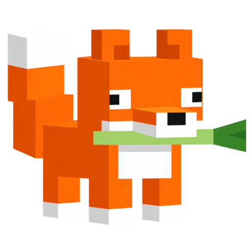

    

# NegiCraft Launcher

[提交问题](https://github.com/negichan/NegiCraft-Launcher/issues/new)

NegiCraft Launcher（简称 NCL）是一个美观、优雅、又有点笨蛋的 Minecraft 启动器。

## 功能

- 🦊我只是一个Minecraft启动器

## 支持平台

| 操作系统 | 支持情况 |
|---|---|
| Windows 10 / 11 x64 | ✅ |
| macOS / Linux | ⚠️ |

需要 [.NET 10 Desktop Runtime](https://get.dot.net/10)。Windows 7 和 8 用不了，.NET 10 本身就不支持它们；macOS 与 Linux 只是代码里有分支，从没在 Windows 之外跑通过一次，能编译不代表能启动。

## 许可证

- 本项目源码使用 [MIT 许可证](LICENSE)。
- `libs/` 下为内置的第三方代码，各自保留原始许可与声明，见对应目录内的 `LICENSE` 与 `VENDOR.md`。
